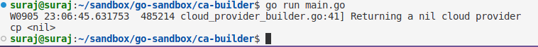
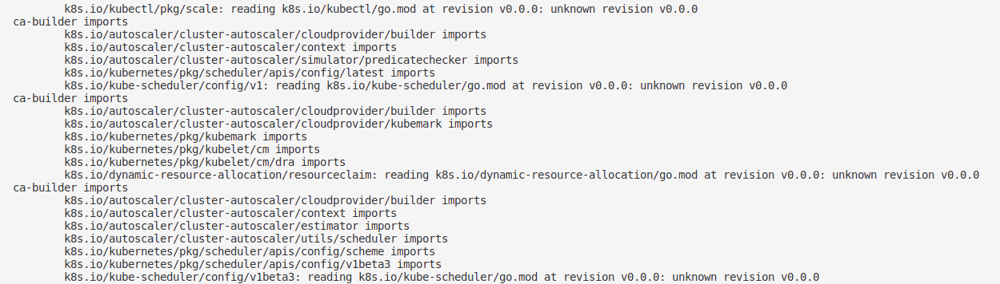

Working `go.mod` file for importing Kubernetes cluster-autoscaler's `k8s.io/autoscaler/cluster-autoscaler/cloudprovider/builder` pkg. Check [slack thread in #sig-autoscaling on Kubernetes slack for more info.](https://kubernetes.slack.com/archives/C09R1LV8S/p1693523160745789)

### Output

If you run into 

Just `go get` the package manually and try `go mod tidy` or `go run main.go` again.